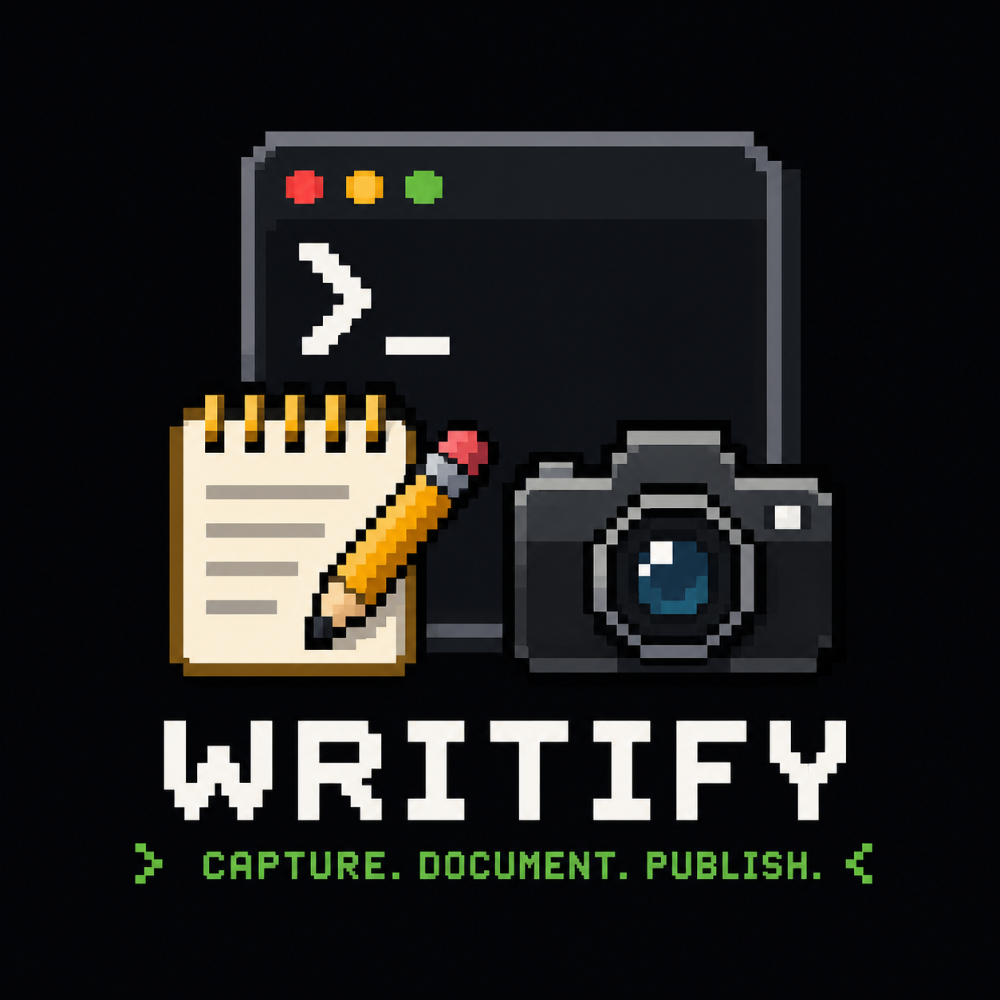
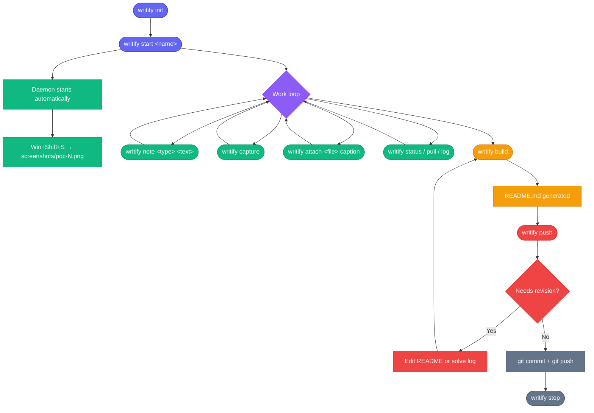

<p align="center">
  
</p>

# Writify

**Writify is a single PowerShell script that runs a background screenshot daemon, records timestamped notes and attached files into a structured solve log, and compiles everything into a clean GitHub-ready markdown writeup at the end. No Python. No Node. No web app. PowerShell 5.1 and Git are the only requirements.**

[](https://github.com/cybersagnik/writify/releases)
[](https://docs.microsoft.com/en-us/powershell/)
[](#license)
[](https://github.com/cybersagnik/writify)


→ [Quick Start](#quick-start) · [Features](#features)

---

## Installation

**1. Download**

```powershell
git clone https://github.com/cybersagnik/writify
```

**2. Bypass Execution Policy & Install globally as a command**

```powershell
Set-Execution Set-ExecutionPolicy -Scope Process Bypass
.\writify.ps1 init
```

`init` copies the script to `~/bin/writify.ps1` and adds a `writify` function to your `$PROFILE`. Open a new shell and you're done.

**Requirements:** PowerShell 5.1+ · Git

---

## Quick Start

```powershell
writify start web-challenge-name
cd web-challenge-name

# Take notes as you work
writify note observation "Login form sends credentials in plaintext"
writify note command "sqlmap -u 'http://target/login' --data 'user=a&pass=b'"
writify note finding "SQLi in user parameter, UNION-based"

# Win+Shift+S to snip → daemon auto-saves to screenshots/poc-N.png
# Attach a screenshot at the current timeline position
writify attach screenshots\poc-1.png "UNION injection successful"

# Attach a script or exploit
writify attach exploit.py "Final exploit"

# Build and push
writify build
writify push
```

---

## Features

- **Background screenshot daemon** — starts automatically with the workspace; captures Win+Shift+S snips without any extra keystrokes
- **Timeline-based note capture** — every note and attachment is timestamped and ordered, so the final writeup reflects your actual solve flow
- **Custom note types** — use built-in types (`observation`, `finding`, `command`, `result`, `dead_end`) or any arbitrary string
- **Dead-end tracking** — notes of type `dead_end` render as ~~strikethrough~~ in the final README
- **Inline screenshots and code** — `attach` inserts images and source files at the exact timeline position where you ran them
- **Syntax-highlighted code blocks** — language is inferred from file extension for Python, Bash, Go, Rust, PowerShell, and more
- **Deterministic README generation** — `build` renders the ordered solve log into a structured `README.md` every time
- **README review before push** — `push` previews the first 80 lines and opens a revision loop before committing
- **Workspace-only Git tracking** — only `README.md`, `screenshots/`, and `artifacts/` are committed; runtime state stays local
- **Zero extra dependencies** — PowerShell 5.1 and Git are the only requirements

---

## Commands

| Command | Description |
|---------|-------------|
| `init` | Install Writify globally and configure Git identity |
| `start <name>` | Create a workspace, initialise a Git repo, start the capture daemon |
| `note <type> <text>` | Append a timestamped note to the solve log |
| `attach <file> [caption]` | Copy a file into the workspace and log it at the current position |
| `capture` | Manual full-screen grab fallback → `screenshots/poc-N.png` |
| `build` | Generate `README.md` from the ordered solve log |
| `push` | Preview README → optional revision loop → commit → `git push` |
| `status` | `git status` in the workspace |
| `pull` | `git pull` in the workspace |
| `stop` | Stop the background capture daemon |
| `log` | Print the raw solve log |

---

## Demo Workflow



---

## Workspace Layout

```
challenge-name/
├── README.md
├── screenshots/
├── artifacts/
└── .writify/
```

`README.md`, `screenshots/`, and `artifacts/` are tracked by Git. `.writify/` contains local runtime state and is excluded from commits.

---

## Configuration

Workspace settings are stored in `.writify/config.json` and are set interactively during `writify start`.

| Field | Description |
|-------|-------------|
| `NAME` | Workspace and writeup title |
| `DESCRIPTION` | Overview paragraph rendered at the top of the README |
| `AUTHOR` | Author name (falls back to `git config user.name`) |
| `REMOTE` | Git remote URL (can be set later; `push` will prompt if missing) |

To update a field, edit `.writify/config.json` directly and run `writify build` to regenerate.

---

## FAQ

**Does the daemon run in the background while I work?**  
Yes. `writify start` launches a hidden PowerShell process that monitors the clipboard. Any Win+Shift+S snip is automatically saved to `screenshots/poc-N.png`. Run `writify stop` when you're done.

**Do screenshots automatically appear in the README?**  
No. The daemon saves them to disk; you decide which ones matter. Run `writify attach screenshots\poc-1.png "caption"` to insert a screenshot at the right point in the timeline.

**What if I don't want to use the daemon?**  
`writify capture` takes a full-screen grab on demand without the daemon running.

**Can I use custom note types beyond the defaults?**  
Yes. Any string is valid: `writify note recon "Initial enumeration"`, `writify note bypass "Bypassed WAF with null byte"`, and so on.

**What gets pushed to GitHub?**  
Only `README.md`, `screenshots/`, and `artifacts/`. The `.writify/` directory is gitignored and stays local.

---

## Contributing

1. Fork [cybersagnik/writify](https://github.com/cybersagnik/writify)
2. Create a branch: `git checkout -b feat/your-feature`
3. Make your changes and add tests where applicable
4. Open a pull request against `main`

Please keep the zero-extra-dependencies constraint: no npm, pip, or external binaries.

---

## License

MIT © [Sagnik Ray](https://github.com/cybersagnik)
