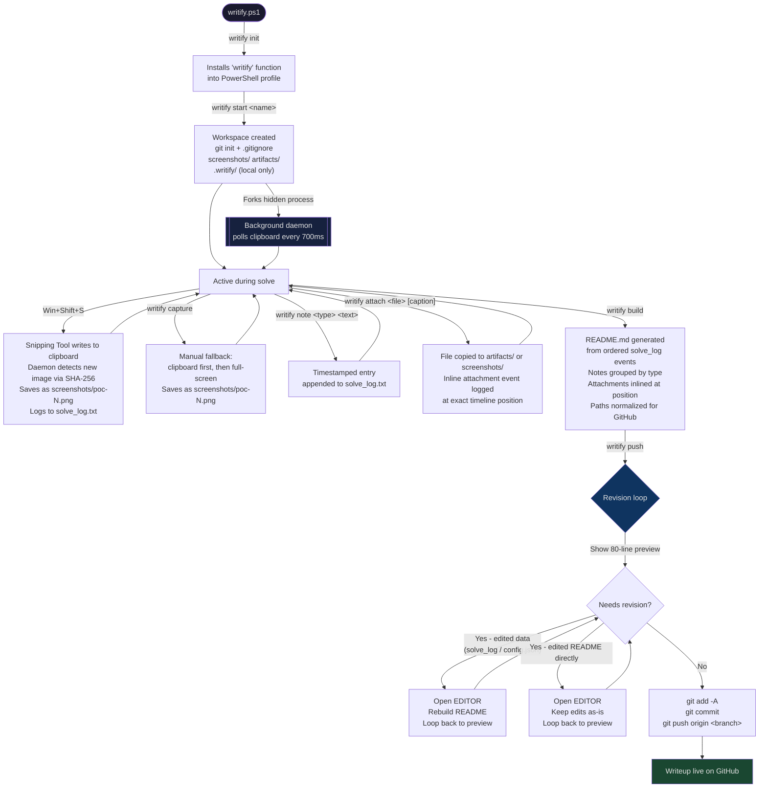

# Writify

> Capture your work as you do it. Build the writeup when you are done.

Writify is a single PowerShell script that runs a background screenshot daemon, records timestamped notes and attached files into a structured solve log, and compiles everything into a clean GitHub-ready markdown writeup at the end. No Python. No Node. No web app. PowerShell 5.1 and Git are the only requirements.

---

## How it works

Most writeup tools hand you a blank template and expect you to fill it in after the fact, when your memory of the exact steps has already faded. Writify flips that. You capture observations, commands, findings, and screenshots as you work. When you finish, `writify build` assembles the README from the log in timeline order. `writify push` lets you review and revise before anything is committed.

The workspace is a single Git repository. `.writify/` holds runtime state and is gitignored. Git tracks only `README.md`, `screenshots/`, and `artifacts/`.

---

## Workflow



---

## Installation

**Requirements:** PowerShell 5.1 or later (built into Windows 10+) and [Git for Windows](https://git-scm.com).

```powershell
# 1. Download the script
Invoke-WebRequest -Uri https://raw.githubusercontent.com/YOUR_ORG/writify/main/writify.ps1 -OutFile writify.ps1

# 2. Run global setup (copies the script to ~/bin and adds a 'writify' function to $PROFILE)
.\writify.ps1 init
```

`init` does three things:

- Copies `writify.ps1` to `$HOME\bin\writify.ps1`
- Writes `function writify { & "...\writify.ps1" @args }` into your PowerShell `$PROFILE`
- Optionally sets `git config --global user.name` and `user.email`

After that, `writify` is available as a plain command in every new PowerShell session. In the current session it is already active without needing to reload the profile.

If Git is not found in `$PATH`, the script prints an error pointing to https://git-scm.com.

---

## Quickstart

```powershell
# One-time setup
writify init

# Create a workspace
writify start sqli-login-bypass

cd sqli-login-bypass

# Capture work as you go
writify note observation "Login form POSTs to /auth with no CSRF token"
writify note command "sqlmap -u 'https://target.com/auth' --data 'user=a&pass=b' --dbs"

# Take a screenshot with Win+Shift+S — the daemon saves it automatically as poc-1.png.
# Or use the manual fallback:
writify capture

writify note finding "Database 'app' contains table 'users'"
writify note command "sqlmap ... -D app -T users --dump"
writify attach exploit.py "Final injection payload"
writify note result "Extracted admin credentials. Login confirmed."

# Build the writeup
writify build

# Review, revise if needed, then push
writify push
```

---

## Commands

### `writify init`

Global setup. Copies the script to `$HOME\bin\writify.ps1`, registers the `writify` function in `$PROFILE`, and optionally configures `git config --global` author details. Run once per machine.

---

### `writify start <name>`

Creates a new workspace directory named `<name>` in the current location. Prompts for:

- A short description (stored in config, used as the Overview section in the README)
- Author name (defaults to `git config user.name`)
- Git remote URL (optional — can be set later)

Sets up the following structure, runs `git init`, commits the scaffold, and starts the background capture daemon:

```
<name>/
  README.md          <- placeholder until 'writify build'
  .gitignore         <- tracks only README.md, screenshots/, artifacts/
  screenshots/
  artifacts/
  .writify/          <- local runtime state, never committed
    config.json
    solve_log.txt
    poc_counter.txt
    daemon.pid
    capture.trigger
    last_build.txt
    daemon_loop.ps1
```

---

### `writify note <type> <text>`

Appends a timestamped entry to `solve_log.txt`. The type can be any lowercase string. Five types have predefined rendering behavior:

| Type | Rendered as |
|---|---|
| `observation` | Bullet list under **Observations** |
| `finding` | Bullet list under **Findings** |
| `command` | Fenced `powershell` code block under **Commands** |
| `dead_end` | Strikethrough bullet under **Dead Ends** |
| `result` | Bullet list under **Results** |

Any other type string is accepted. It becomes a title-cased section heading — for example, `writify note hypothesis "..."` produces a **Hypothesis** section. Underscores and hyphens are treated as word separators.

Notes that share the same type are grouped together into a single section only if they are consecutive in the log. If you interleave two different types, each run of notes gets its own section in timeline order.

```powershell
writify note observation "Rate limiting is absent on the login endpoint"
writify note command "ffuf -u https://target.com/login -w passwords.txt -X POST"
writify note finding "Password 'summer2024' accepted for user admin"
writify note dead_end "Tried JWT RS256 confusion — server rejected HS256 tokens"
writify note result "Achieved authenticated session as admin"
```

---

### `writify attach <file> [caption]`

Copies a file into the workspace and logs an inline attachment event at the current position in the solve log. The attachment is rendered at that exact point in the README — not in a separate Attachments section at the end.

- Image files (`.png`, `.jpg`, `.jpeg`, `.gif`, `.bmp`, `.webp`) go to `screenshots/` and are rendered as ``.
- All other files go to `artifacts/` and are rendered as a fenced code block with syntax highlighting inferred from the extension.

Supported syntax highlighting extensions: `.py`, `.ps1`, `.js`, `.ts`, `.go`, `.c`, `.cpp`, `.h`, `.java`, `.sh`, `.rb`, `.php`, `.rs`.

```powershell
# Attach a script — renders as an inline code block
writify attach exploit.py "SQLi extraction script"

# Attach a captured screenshot to embed it at this point in the writeup
writify attach screenshots\poc-2.png "Admin panel after authentication"
```

Paths in the generated README are normalized to forward slashes so they render correctly on GitHub regardless of how Windows stored them.

---

### `writify capture`

Manual screenshot fallback. Behaviour depends on whether the daemon is running:

- **Daemon running:** writes a trigger file. The daemon picks it up within 700 ms, tries the clipboard first (in case a snip was just taken), and falls back to a full virtual-screen capture. Reports the saved filename.
- **Daemon not running:** directly attempts clipboard first, then full-screen capture in the same process.

Either way the file is saved as `screenshots\poc-N.png` where N is the next sequential number, and the event is logged to `solve_log.txt`.

`writify capture` is not required for Win+Shift+S screenshots — the daemon handles those automatically. Use `capture` when you want a deliberate full-screen grab or when the daemon is stopped.

---

### `writify build`

Generates `README.md` from `config.json` and `solve_log.txt`. The output is fully deterministic — given the same inputs it always produces the same output.

**Structure of the generated README:**

```
# <workspace name>

**Author:** ...
**Date:** YYYY-MM-DD

## Overview
<description from config.json>

## Observations
- ...

## Commands
```powershell
...
```

## Findings
- ...

[attachments inlined at their logged position]

---
_Generated by Writify v1.0.0 - <timestamp>_
```

Sections appear only if there are notes of that type. Custom note types produce their own titled sections. Attachments appear inline at the exact point they were logged, not appended at the end.

Screenshot events in `solve_log.txt` are **not** automatically included in the README. To embed a screenshot, attach it explicitly with `writify attach screenshots\poc-N.png "caption"` at the point in your workflow where it belongs.

---

### `writify push`

Prepares and publishes the writeup. The full sequence:

1. **Auto-rebuild.** If `solve_log.txt` has been modified since the last build, runs `writify build` automatically before proceeding.
2. **Preview.** Prints the first 80 lines of `README.md` to the terminal.
3. **Revision loop.** Asks: `Needs revision before pushing? [y/N]`
   - If **yes**: asks what should change, records the revision note in `solve_log.txt`, asks whether you edited the data files or the README directly, opens `$env:EDITOR` on the relevant files (or prompts you to edit manually and press Enter if `$EDITOR` is not set), rebuilds if you edited data, then returns to step 2.
   - If **no**: proceeds to commit.
4. **Commit and push.** Runs `git add -A`, commits with the message `writeup: <name> YYYY-MM-DD`, and pushes to `origin <current-branch>`. If no remote is configured, prompts for a URL and saves it to `config.json`.

```powershell
writify push
# -> README.md preview (80 lines)
# -> Needs revision before pushing? [y/N]: y
# -> What should be changed?: Add the flag to the result section
# -> Edited README directly, or underlying data (solve_log/config)? [readme/data]: data
# -> (opens $EDITOR on solve_log.txt and config.json)
# -> rebuilds
# -> preview loop repeats
# -> Needs revision before pushing? [y/N]: n
# -> git add -A && git commit && git push
```

---

### `writify pull`

Runs `git pull` in the workspace. Must be run from inside the workspace directory.

---

### `writify status`

Runs `git status` in the workspace.

---

### `writify log`

Prints the raw contents of `solve_log.txt` to the terminal. Each line is a pipe-delimited record:

```
2025-07-11T14:22:00Z|note|observation|Login form has no CSRF token
2025-07-11T14:23:15Z|note|command|sqlmap -u 'https://target.com/login' --dbs
2025-07-11T14:31:02Z|screenshot|screenshots\poc-1.png
2025-07-11T14:35:44Z|attach|artifacts\exploit.py|file|Final injection payload
```

---

### `writify stop`

Stops the background capture daemon by reading `.writify\daemon.pid` and terminating the process. Safe to call if the daemon is already stopped.

---

## Background capture daemon

When `writify start` creates a workspace, it launches a hidden PowerShell process (`daemon_loop.ps1`) that runs in the background for the lifetime of the session. The daemon:

- **Polls the clipboard every 700 ms** using SHA-256 to detect when a new image appears. This is the primary detection path for Win+Shift+S screenshots.
- **Watches a trigger file** (`capture.trigger`) for explicit `writify capture` calls.
- Saves each new image as `screenshots\poc-N.png` where N increments from the shared counter.
- Logs each capture as a `screenshot` event in `solve_log.txt`.

The daemon requires `-STA` (Single-Threaded Apartment) mode for reliable clipboard access and uses `System.Windows.Forms` and `System.Drawing`, both of which are available in all PowerShell 5.1 environments without additional installation.

The daemon process ID is stored in `.writify\daemon.pid`. Run `writify stop` to terminate it. The daemon does not restart automatically if PowerShell is closed — run `writify start` again or restart the daemon by opening a new session in the workspace directory.

**Screenshot workflow in practice:**

```
Win+Shift+S     ->  draw region  ->  confirm snip
                                         |
                              clipboard updated
                                         |
                          daemon detects SHA-256 change
                                         |
                      saves screenshots\poc-N.png
                      logs to solve_log.txt

writify attach screenshots\poc-2.png "Impact of stored XSS"
                                         |
                      embedded inline at this point in README
```

---

## Workspace layout

```
<workspace>/
  README.md                  <- generated by 'writify build', committed to Git
  .gitignore                 <- excludes everything except README.md, screenshots/, artifacts/
  screenshots/
    poc-1.png                <- auto-saved by daemon (Win+Shift+S or 'writify capture')
    poc-2.png
  artifacts/
    exploit.py               <- copied in by 'writify attach'

  .writify/                  <- local runtime state, never committed
    config.json              <- name, description, author, remote URL, created timestamp
    solve_log.txt            <- append-only event log (notes, attachments, screenshots)
    poc_counter.txt          <- current screenshot sequence number
    daemon.pid               <- PID of the background capture process
    capture.trigger          <- signal file read by the daemon for manual captures
    last_build.txt           <- timestamp of the most recent 'writify build'
    daemon_loop.ps1          <- the daemon script, written at 'writify start' time
```

Git sees only `README.md`, `screenshots/`, and `artifacts/`. Everything in `.writify/` is excluded by `.gitignore`.

---

## Use cases

| Scenario | Example |
|---|---|
| CTF writeup | `writify start pwn-babyrop` — note recon steps, attach exploit, capture flag screenshot |
| Bug bounty PoC | `writify start xss-stored-cors` — capture impact with Win+Shift+S, attach payload file |
| Penetration test evidence | `writify start internal-sqli-2025` — log commands run, attach output files, embed screenshots |
| Security research | `writify start cve-2025-1234` — document reproduction steps with timestamped observations |
| University lab report | `writify start lab4-heap-overflow` — capture methodology and outputs, attach analysis script |

---

## Non-goals

These are intentional omissions, not missing features.

- **No AI-generated content.** `writify build` is fully deterministic. The README is built from your own notes and attachments.
- **No publish or export step.** The workspace repository is the artifact. There is no separate clean export or dual-repo workflow.
- **No CI pipeline generation.** Writify does not write GitHub Actions workflows.
- **No web UI.** The entire tool is a single `.ps1` file operated from a terminal.
- **No database.** State is stored in plain text files inside `.writify/`.
- **No OAuth or API keys.** Git authentication uses whatever credential helper you have configured.
- **No multi-user features.** Writify is a single-operator per-workspace tool.

---

## Requirements

| Requirement | Details |
|---|---|
| PowerShell | 5.1 or later. Built into Windows 10 and Windows 11. |
| Git | Any recent version. [git-scm.com](https://git-scm.com) |
| .NET assemblies | `System.Windows.Forms` and `System.Drawing` — present in all PowerShell 5.1 environments, no install needed. |

No additional packages, package managers, or runtimes are required.

---

## Command reference

| Command | Description |
|---|---|
| `writify init` | Install `writify` as a global command and configure git author defaults |
| `writify start <name>` | Create a workspace, run `git init`, start the capture daemon |
| `writify note <type> <text>` | Append a timestamped note to the solve log |
| `writify attach <file> [caption]` | Copy a file into the workspace and log it at the current timeline position |
| `writify capture` | Take a screenshot immediately (clipboard or full-screen fallback) |
| `writify build` | Generate `README.md` from the solve log |
| `writify push` | Review README, enter revision loop if needed, commit and push |
| `writify pull` | `git pull` |
| `writify status` | `git status` |
| `writify log` | Print the raw solve log |
| `writify stop` | Stop the background capture daemon |

---

*Writify v1.0.0*